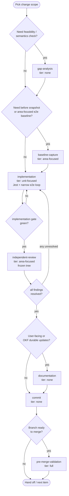
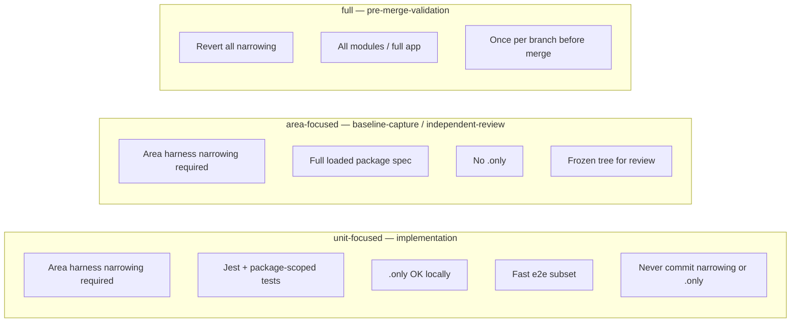
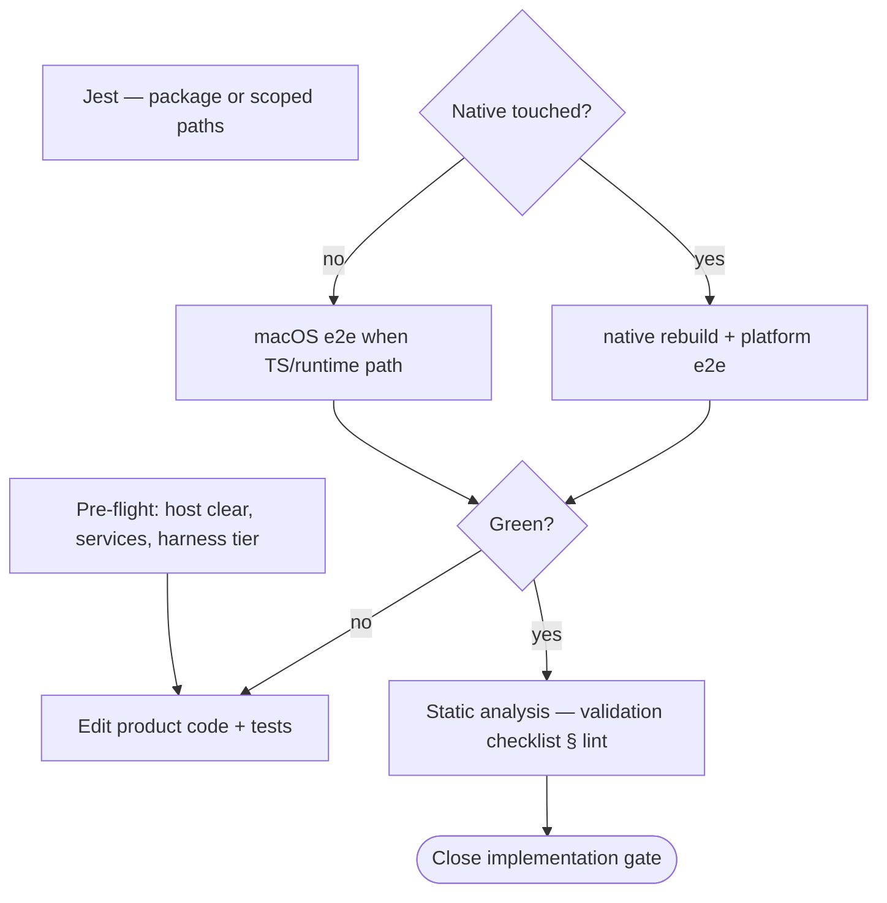

# Change authoring workflow

Single source for **how to author and verify a product change** in RNFB (bug fix, feature, parity, coverage). Package workflows add artifacts; work queues add ephemeral gate state — neither restates this loop.

**Policy:** [OKF documentation and commit policy](../documentation-policy.md). **Terms:** [iteration vocabulary](iteration-vocabulary.md).

## Primary loop



## Work types

| Work type | When | Validation tier | Product edits | Commit |
|-----------|------|-----------------|---------------|--------|
| `gap-analysis` | Unclear feasibility, export shape, platform support | none | read-only | no |
| `baseline-capture` | Need before metrics or area-focused e2e on the item | `area-focused` | harness narrow OK locally | no |
| `implementation` | Author fix/feature + tests | `unit-focused` | yes | no |
| `independent-review` | Verify frozen diff | `area-focused` | no — [frozen tree](#frozen-tree) | no |
| `documentation` | User docs + durable OKF updates | none | docs only | no |
| `commit` | Gates closed for the item | none | staging only | yes |
| `pre-merge-validation` | Branch merge gate | `full` | revert narrowing first | no |

**Commands per work type:** [validation checklist](validation-checklist.md) — link only; do not duplicate here.

## Validation tiers

Tier id strings: [iteration vocabulary § validation tier identifiers](iteration-vocabulary.md#validation-tier-identifiers).



E2e scope, pre-flight, and harness gate: [running e2e § agent rule](running-e2e.md#agent-rule-read-first) (canonical commands only), [validation tiers](running-e2e.md#e2e-validation-tiers-unit-focused-area-focused-full), [harness narrowing gate](running-e2e.md#harness-narrowing-gate-blocking).

**Command rule:** Agents run **only** [agent command policy](agent-command-policy.md) allowlisted commands for install, prepare, and validation — no improvised `yarn workspace … prepare`, `yarn jet`, or package-scoped build probes.

## Gates

| Gate | Closes when |
|------|-------------|
| `implementation` | `implementation` work type complete — code plus **unit-focused**-tier checks green on **every required platform** when native bridge or embed path changed ([platform coverage gate](running-e2e.md#platform-coverage-gate-blocking)); [static analysis](validation-checklist.md#lint-and-formatting) green on the diff |
| `review` | `independent-review` complete — **area-focused**-tier checks green on frozen tree; applicable [validation checklist](validation-checklist.md) rows green (including static analysis); **every review finding resolved** ([§ quality standards](#quality-standards)) |
| `commit` | Durable commit exists for the item **after** prior gates closed with [recorded evidence](#validation-evidence-blocking) |

**Trust rule:** Code on disk or in git with `review` still **open** is unverified until `independent-review` closes the gate.

Any unresolved review finding returns the item to **`implementation`** (`unit-focused`), then repeats **`independent-review`** (`area-focused`) — see [§ quality standards](#quality-standards).

<a id="validation-evidence-blocking"></a>

### Validation evidence (blocking)

Gates close **only** when **recorded evidence** shows the required validation tier ran and passed. Assumed green, implementer summaries without exit codes, or "tests passed earlier" without a log path **do not** close a gate.

| Gate | Minimum evidence (record in work-queue notes or review handoff) |
|------|------------------------------------------------------------------|
| **`implementation`** | Prepare/tsc/jest **exit codes**; when native or macOS runtime touched: **e2e pass count per required platform** + log path (e.g. `/tmp/rnfb-e2e-*.log`); lint exit code |
| **`review`** | Frozen-tree re-run of area-focused checklist; **coverage evidence package** when native or `packages/*/lib/**` bridge code touched ([coverage design § evidence package](coverage-design.md#coverage-evidence-package)); compare:types row for touched registered package |
| **`commit`** | Prior gates closed **with evidence**; no `.only` / harness overrides staged |
| **Publication** (`git push`, force-push, PR refresh) | **`review` gate closed on the exact commits being published**; evidence still valid (no product edits since last area-focused run) |

**Investigate before close:** Any coverage plateau, parity asymmetry, or review finding gets **root-cause analysis** — add tests, delete dead code, or record an [acceptable exception](#acceptable-exceptions) with evidence. Do not label gaps "informational" or "defensive" without wire/runtime proof.

<a id="forbidden-shortcuts"></a>

### Forbidden shortcuts

- **`git commit`** while the current work type's validation tier is incomplete or evidence is missing.
- **`git push` / force-push / PR update** claiming remediation or review-green **without** fresh area-focused evidence after the last product edit on the published commits.
- **History rewrite** (rebase, amend stack) **without** re-running validation for the rewritten scope — prior green results are **invalid**.
- **Self-accepted** parity or coverage gaps — only [acceptable exceptions](#acceptable-exceptions) with user confirmation or intractability evidence in durable OKF (e.g. parity registry row).

Publication is not a separate work type; it follows the same evidence bar as `review` + `commit`.

## Quality standards

Two authoring standards gate every item, and both admit the same narrow set of [acceptable exceptions](#acceptable-exceptions) — the only things that may be documented and tracked instead of fixed.

<a id="acceptable-exceptions-intractable-limitation-bar"></a>

### Acceptable exceptions

Only two things may be documented and tracked instead of fixed. **Both require the user's explicit acceptance and confirmation plus a recorded rationale** — an agent or reviewer may not grant either on its own, and the item stays tracked until resolved.

1. **Intractable-limitation bar.** The gap or firebase-js-sdk divergence is caused by an intractable technical limitation of the language, platform SDK, compiler, or toolchain, shown with evidence — e.g. a compiler/codegen-expanded branch that is provably unreachable, or a native SDK that does not expose the capability, cited by version.
2. **User-accepted deferral.** The gap is addressable, but the user explicitly defers it with a documented rationale — e.g. it needs architectural design or human review not available now, or the compute cost is not currently justified.

Anything else is drift or a defect, never a self-justifying exception:

- **If code can be authored, a test that exercises it can be authored** — otherwise it is dead code; delete it, do not document it.
- **A divergence with no accepted exception is drift** — align to firebase-js-sdk and remove any config entry.
- Convenience, time pressure, "harmless", "low-value", or "low-risk" carry weight **only** through an explicit user-accepted deferral (2), never on an agent's own authority.

<a id="review-findings--resolve-do-not-defer"></a>

### Review findings — resolve, do not defer

`independent-review` classifies findings **critical / serious / minor / nit**. The **`review` gate closes only when every finding — including minor and nit — is resolved by a fix**, unless the finding is covered by one of the two [acceptable exceptions](#acceptable-exceptions). An agent or reviewer may **not** defer a finding on its own authority: "green with minors" is not green, and parity, quality, and coverage gaps are cheapest to fix while the diff is fresh.

A finding covered by an accepted exception is recorded — with evidence or the user's rationale — and tracked, not silently dropped. A finding that is neither fixed nor covered by an accepted exception returns the item to **`implementation`**.

Domain applications reference this section rather than restating it:

- **Coverage completion:** [coverage design § expectations](coverage-design.md#coverage-expectations-policy).
- **Type parity / API drift:** [compare-types justification bar](../../.github/scripts/compare-types/README.md#justification-bar).

## Frozen tree

Required for **`independent-review`** and for any `:test-cover` run that closes the **`review`** gate:

- No edits to `packages/**`, `tests/**` (except reverting `.only`), or bundle-affecting OKF docs during the run.
- Wait for or cancel in-flight runs before editing again.

Keep **`implementation`** and **`independent-review`** in separate passes. E2e enforcement during runs: [running e2e § rules](running-e2e.md#rules).

## Host rule

On a shared dev host during change authoring:

- One `:test-cover` at a time — never overlap **unit-focused**-tier and **area-focused**-tier runs.
- Every run starts from [running e2e § pre-flight](running-e2e.md#pre-flight-is-the-host-clear-to-start) (host-clear probes, services, harness tier).
- Use only [canonical e2e commands](running-e2e.md#rules). Stalled runs → [stalled run detection](running-e2e.md#stalled-run-detection).

## `implementation` inner loop



**Host rule:** one `:test-cover` at a time; never overlap **unit-focused** and **area-focused** tiers on one host ([§ host rule](#host-rule)).

**Static analysis before handoff:** Before closing the **`implementation`** gate, run the [validation checklist § lint and formatting](validation-checklist.md#lint-and-formatting) rows (`yarn lint:js`; `yarn lint:markdown` / `yarn lint:spellcheck` when docs changed). Fix violations in product code — do not hand off with lint failures. Command list lives only in the checklist; do not duplicate here.

Step detail: [running e2e § unit-focused iteration loop](running-e2e.md#unit-focused-tier-iteration-loop).

<a id="platform-sdk-bridge-contracts"></a>

### Platform SDK bridge contracts (blocking)

Before changing native bridge code that calls a **platform SDK** (Firebase Android/iOS, OS APIs, vendor SDKs, etc.):

1. **Read each platform's official API signature and docs independently** — do not assume Android, iOS, and Web behave the same because the RNFB bridge presents a unified JavaScript surface.
2. **Verify null vs empty string** — many SDKs treat absent values (`null`/`nil`) and empty strings (`""`) differently; map bridge fields to the SDK parameter the docs specify for "absent" values.
3. **Do not apply defensive parity** — fixing platform A does not justify the same change on platform B without checking B's contract (e.g. `@Nullable` vs `nonnull`, optional vs required).
4. **Record evidence** — link or cite the reference URL / header signature in the work queue note or triage report when the fix is native-only on one platform.

<a id="e2e-diagnosis-escalation"></a>

### E2e diagnosis escalation

When **`unit-focused`** e2e fails and product cause is unclear:

1. Confirm [pre-flight](running-e2e.md#pre-flight-is-the-host-clear-to-start) was complete ([prepare completion gate](running-e2e.md#prepare-completion-gate-blocking) when `lib/**` changed, host-clear probes, services, harness overrides, **`RNFBDebug: true`** via overrides).
2. If the **same failure repeats** on back-to-back runs with no assertion progress and the host is known clean → **sub-suite narrow** ([running e2e § fail-fast](running-e2e.md#fail-fast-rnfbdebug-and-sub-suite-narrowing)): one spec file or `describe.only` on the failing band (e.g. aggregate `count()` / `average()` / `sum()` only). Still **unit-focused**; never commit narrowing.
3. If sub-suite runs still fail without actionable assertion text → add **temporary native instrumentation** (NSLog, `adb logcat` tags, etc.) on the code path under test; use [running e2e § diagnosing hangs](running-e2e.md#diagnosing-hangs) for log commands. **Remove instrumentation before `commit`** and before **`area-focused`** gate closure on a frozen tree.
4. Do not treat Jet WS disconnect / orchestration timeout alone as product failure — [stalled run detection](running-e2e.md#stalled-run-detection) and pre-flight recovery first.

This escalation applies to **any** change authoring item, not only namespace removal. Work queues record outcomes; they do not restate this loop.

## `independent-review`

On a **frozen tree**:

1. Revert all `.only`.
2. Keep area narrowing; run **area-focused**-tier e2e for loaded package spec(s) on [**every required platform**](running-e2e.md#platform-coverage-gate-blocking) (serial; pre-flight each run).
3. Run applicable [validation checklist](validation-checklist.md) rows — **blocking:** [static analysis § lint and formatting](validation-checklist.md#lint-and-formatting) (`yarn lint:js` on the frozen tree; markdown/spellcheck when docs touched); `yarn reference:api` when public surface changed. For packages registered in `compare:types`, `yarn compare:types` is a **blocking review gate**: the touched package must have zero undocumented or stale differences before `review_gate` closes. If the global command fails on unrelated registered packages, record/fix that drift in the work queue; do not treat an unrelated failure as permission to skip the touched package's type-parity check.
4. **Coverage evidence package** — **blocking** when `packages/*/lib/**` or native bridge sources in the frozen diff: produce and attach per [coverage design § evidence package](coverage-design.md#coverage-evidence-package); investigate every non-100% reachable line before closing `review`.
5. Outcome closes **review gate** or returns to **`implementation`**.

Keep **`implementation`** and **`independent-review`** in separate passes ([§ frozen tree](#frozen-tree)).

## Harness narrowing

**Before the first `:test-cover` at `unit-focused` or `area-focused` tier:** create local [`tests/harness.overrides.js`](../../tests/harness.overrides.example.js) even when the branch commit has full harness — [running e2e § local harness overrides](running-e2e.md#local-harness-overrides-harnessoverridesjs). Set `modules` to the package area and **`RNFBDebug: true`**. Full app load is **`full`** tier only (delete overrides file).

| Kind | `implementation` (**unit-focused**) | `independent-review` (**area-focused**) | `pre-merge-validation` (**full**) | `commit` |
|------|-------------------------------------|------------------------------------------|-----------------------------------|----------|
| **Area narrowing** | Required before `:test-cover` (overrides file) | Required before `:test-cover` | Delete overrides — all modules | Never commit overrides |
| **`RNFBDebug: true`** | Required in overrides before `:test-cover` | Required in overrides before `:test-cover` | Delete overrides / `false` | Never |
| **Single-test** (`.only`) | Allowed (diagnosis) | Revert | Revert | Never |
| **Single-suite** (`describe.only` / one spec file) | Allowed (diagnosis only — [escalation](#e2e-diagnosis-escalation)) | Revert | Revert | Never |

Package workflows define **which module/spec** to load (e.g. Firestore → [pipeline implementation workflow § narrowing](../packages/firestore/pipeline-implementation-workflow.md#pipeline-area-harness)).

**Sanity check:** pass counts must match loaded scope — not full-app totals ([running e2e § gate](running-e2e.md#harness-narrowing-gate-blocking)).

## `commit`

- One focused commit per item when gates close.
- **Evidence required:** [§ validation evidence](#validation-evidence-blocking) must be recorded before `commit_gate` closes; orchestration summaries are not substitutes for exit codes, e2e counts, and coverage tables.
- **Never stage:** `tests/harness.overrides.js`, any `.only`, temporary sub-suite edits in `tests/app.js`, or native instrumentation ([running e2e § before merge](running-e2e.md#before-merge-pr-handoff), [platform coverage gate](running-e2e.md#platform-coverage-gate-blocking)).
- **Work queue:** before `git commit`, set the row's `commit_subject` to the commit's subject line, close `commit_gate`, and stage the queue doc **in the same commit** as the product change ([documentation policy § work queues](../documentation-policy.md#work-queue-documents)). Do not record SHAs in queue docs.

```bash
git status
git diff --stat
rg '\.only\(' packages/
```

## Package extensions

| Package / area | Adds to this loop |
|----------------|-------------------|
| Firestore Pipelines | Compare-types gap pick, serialization matrix, `Pipeline.e2e.js` setup, coverage snapshots — [pipeline implementation workflow](../packages/firestore/pipeline-implementation-workflow.md) |
| TurboModule migration | Spec inventory, codegen commit, New Architecture harness, multi-module spec split — [turbomodule implementation workflow](../new-architecture/turbomodule-implementation-workflow.md) |
| Other packages | `okf-bundle/packages/<pkg>/` index when a workflow exists |

Ephemeral coordination (gate rows, `next_work_type`, `commit_subject`): **work queues only** — not part of this workflow.

## Related docs

| Topic | Document |
|-------|----------|
| Term ids and queue field schema | [iteration-vocabulary.md](iteration-vocabulary.md) |
| E2e commands | [running-e2e.md](running-e2e.md) |
| Validation commands | [validation-checklist.md](validation-checklist.md) |
| Coverage policy | [coverage-design.md](coverage-design.md) |
