# Overview

RNFB Detox/Jet e2e uses Firebase project **`react-native-firebase-testing`**. Most modules use local emulators; **Firestore Pipelines**, **Installations**, and **Remote Config fetch/activate** hit live Google APIs on the shared project.

```mermaid
flowchart TB
  subgraph app [tests/app.js before hook]
    A["connectAuthEmulator :9099"]
    D["connectDatabaseEmulator :9000"]
    F1["connectFirestoreEmulator (default) :8080"]
    F2["connectFirestoreEmulator second-rnfb :8080"]
    FN["connectFunctionsEmulator :5001"]
    S["connectStorageEmulator :9199"]
  end

  subgraph emulator [Local Emulator Suite]
    E[".github/workflows/scripts/firebase.json"]
    E --> FS["Firestore (default) Standard"]
    E --> AU["Auth / RTDB / Functions / Storage"]
  end

  subgraph cloud [Google Cloud — react-native-firebase-testing]
    C1["(default) Firestore"]
    C2["second-rnfb database"]
    C3["pipelines-e2e Enterprise eur3"]
    C4["Installations FIS tokens"]
    C5["Remote Config + RC admin helpers"]
    C6["Deployed e2e helper callables"]
  end

  F1 --> FS
  F2 --> FS
  A --> AU
  D --> AU
  FN --> AU
  S --> AU

  PE["Pipeline.e2e.js getFirestore('pipelines-e2e')"] --> C3
  INS["installations() e2e"] --> C4
  RC["remoteConfig() fetch/activate"] --> C4
  RC --> C5
  HELP["FirebaseHelpers.callCloudHelperFunction"] --> C6
```



# Where configuration lives

Config root: [`.github/workflows/scripts/`](../../.github/workflows/scripts/) (`firebase.json` cwd for Firebase CLI). Emulator start: [running e2e § Rules #2](running-e2e.md#rules).

| File | Purpose |
|------|---------|
| [`firebase.json`](../../.github/workflows/scripts/firebase.json) | Emulator ports, multi-database Firestore mapping, functions/database/storage rules paths |
| [`start-firebase-emulator.sh`](../../.github/workflows/scripts/start-firebase-emulator.sh) | Starts auth, database, firestore, functions, storage emulators |
| [`firestore.rules`](../../.github/workflows/scripts/firestore.rules) | Security rules for **`(default)`** database |
| [`firestore.indexes.json`](../../.github/workflows/scripts/firestore.indexes.json) | Composite indexes for **`(default)`** |
| [`firestore.pipelines-e2e.rules`](../../.github/workflows/scripts/firestore.pipelines-e2e.rules) | Security rules for **`pipelines-e2e`** cloud database |
| [`firestore.pipelines-e2e.indexes.json`](../../.github/workflows/scripts/firestore.pipelines-e2e.indexes.json) | Indexes (incl. vector) for **`pipelines-e2e`** |
| [`database.rules`](../../.github/workflows/scripts/database.rules) | Realtime Database rules (emulator) |
| [`storage.rules`](../../.github/workflows/scripts/storage.rules) | Storage rules (emulator) |
| [`functions/`](../../.github/workflows/scripts/functions/) | Cloud Functions used by some e2e (e.g. Vertex AI mock) |
| [`deploy-firestore.sh`](../../.github/workflows/scripts/deploy-firestore.sh) | Deploy Firestore rules + indexes to cloud |
| [`deploy-e2e-cloud-functions.sh`](../../.github/workflows/scripts/deploy-e2e-cloud-functions.sh) | Deploy live e2e helper callables (metrics, App Check, RC admin) |
| [`sync-firestore-indexes.sh`](../../.github/workflows/scripts/sync-firestore-indexes.sh) | Pull indexes from cloud into repo (non-interactive) |
| [`README-firestore.md`](../../.github/workflows/scripts/README-firestore.md) | Short operator cheat sheet |

Runtime wiring:

| File | Role |
|------|------|
| [`tests/app.js`](../../tests/app.js) | `before` hook: `connect*Emulator` for each enabled module |
| [`packages/firestore/e2e/helpers.js`](../../packages/firestore/e2e/helpers.js) | `wipe()` — DELETE against **emulator** REST API only |
| [`tests/android/app/google-services.json`](../../tests/android/app/google-services.json) | Firebase project id `react-native-firebase-testing` |

# Emulator vs cloud by product

## Started locally

Foreground/background emulator start: [running e2e § Rules #2](running-e2e.md#rules).

Runs from `.github/workflows/scripts/`:

| Emulator | Port | Config |
|----------|------|--------|
| Firestore | 8080 | `firestore.rules` + `firestore.indexes.json` for **`(default)`** only |
| Auth | 9099 | — |
| Realtime Database | 9000 | `database.rules` |
| Functions | 5001 | `functions/` (built on start) |
| Storage | 9199 | `storage.rules` |
| Emulator UI | 4000 | enabled in `firebase.json` |

**Emulator deploy:** edit repo rules/indexes and restart emulator. No separate deploy; rules hot-reload.

**Wiping emulator Firestore data** (between tests):

```bash
# Per-database via helpers.wipe() in e2e, or manually:
curl -X DELETE \
  "http://localhost:8080/emulator/v1/projects/react-native-firebase-testing/databases/(default)/documents" \
  -H "Authorization: Bearer owner"
```

## Firestore databases

| Database ID | Edition | Emulator connected? | E2e usage |
|-------------|---------|---------------------|-----------|
| `(default)` | Standard | Yes — `tests/app.js` | Most `packages/firestore/e2e/*` |
| `second-rnfb` | Standard | Yes — same emulator host | `SecondDatabase/*` e2e |
| **`pipelines-e2e`** | **Enterprise** (`eur3`) | **No** | `Pipeline.e2e.js` only |

**Critical:** `Pipeline.e2e.js` uses `getFirestore('pipelines-e2e')`. No `connectFirestoreEmulator` for that DB; `execute()` talks to **live cloud**. Local Standard emulator breaks tests.

**Why not emulator:** emulator multi-DB/rules behavior broke Standard Firestore security-rules e2e when Enterprise pipelines were mixed in. `pipelines-e2e` uses dedicated cloud rules/indexes.

Pipelines require Enterprise. RNFB does not enable Enterprise emulator mode today.

See also [Firestore Pipelines design](/packages/firestore/pipelines.md) for bridge/coercion and coverage notes.

## Live cloud APIs (Installations, Remote Config)

| Product | Emulator in Jet? | Runtime in e2e |
|---------|------------------|----------------|
| **Installations** (`getId`, `getToken`) | **No** | Live `firebaseinstallations.googleapis.com` on shared project |
| **Remote Config** (`fetch`, `activate`, `getValue`) | **No** | Live RC; depends on FIS token from Installations |
| **App Check debug token** | **No** | Live callable `fetchAppCheckTokenV2` via `FirebaseHelpers` |
| **RC template admin** | **No** | Live callable `testFunctionRemoteConfigUpdateV2` |

**Parallel CI load** — All e2e matrix legs (iOS debug/release, Android, macOS Other when RC/App Check modules load) share one FIS project and the same live helper callables. Duplicate namespaced + modular suites doubled token traffic; prefer **modular-only** coverage while namespaced APIs are removed (`xdescribe` v8 blocks per package).

**Do not** route cloud-pressure telemetry through the Functions emulator (`connectFunctionsEmulator` in `tests/app.js`); observability for live API pressure uses **deployed** callables (below).

### CI triage: cloud API quota pressure

Platform-agnostic — can surface on **any** e2e workflow leg that hits live Installations, Remote Config, or cloud helpers while other jobs run concurrently.

**Symptom** — mid/late Jet run (installations / remoteConfig / App Check suites), often with other matrix legs active:

```
installations/token-error … HTTP 503 UNAVAILABLE … firebaseinstallations.googleapis.com
Too many server requests
remoteConfig/failure … Failed to get installations token
```

RC cases cascade when FIS token fetch fails. Functions emulator tests may still pass in the same run — this is **not** an emulator failure.

**Cause** — Live Google APIs on shared project `react-native-firebase-testing` (table above). Parallel GHA jobs multiply FIS and helper-callable traffic.

**Mitigations in this repo**

| Change | Location |
|--------|----------|
| Modular-only installations / RC e2e while namespaced APIs are removed | `packages/installations/e2e/`, `packages/remote-config/e2e/` (`xdescribe` v8 blocks) |
| `RETRYABLE_CLOUD_QUOTA_RE` → one Jet e2e retry; cooldown `RNFB_CLOUD_QUOTA_RETRY_COOLDOWN_MS` (default 90s) before attempt 2 | `tests/e2e/firebase.test.js` (all Detox platforms) |
| Record quota-class Jet failure to Cloud Logging via live `e2eCloudMetricsV2` | `packages/app/e2e/cloud-metrics.js`, `tests/globals.js` |
| On FIS/quota Jet failure, log `cloud-pressure-analysis` pointer (Cloud Logging filter + summary callable URL) — no per-run summary dump | `tests/e2e/firebase.test.js` |

Attempt 2 uses the same platform-specific drain/reboot as other Jet retries (iOS simulator reboot, Android emulator reboot, etc.) — see [iOS operational notes](../ci-workflows/ios.md#operational-notes).

**Diagnosing** (any platform Detox step log):

```bash
rg 'installations/token-error|Too many server requests|remoteConfig/failure|cloudQuota|cloud-pressure-analysis' detox-step.log
rg '\[rnfb-e2e\] retry-eligibility' detox-step.log
```

| Pattern | Meaning |
|---------|---------|
| `cloudQuota: true` + `retryable=true` on attempt 1 | Second Jet attempt should run after cooldown + platform reboot |
| `cloud-pressure-analysis` | Pointer to Cloud Logging / `e2eCloudMetricsSummaryV2` for retrospective cross-run pressure — metrics are not dumped inline |
| Installations fail, `functions()` green | Live API quota, not Functions emulator |

Deploy metrics helpers before expecting summary/metrics in CI: [E2e cloud helper callables](#e2e-cloud-helper-callables).

## E2e cloud helper callables

Live helpers use `FirebaseHelpers.callCloudHelperFunction` → `https://us-central1-react-native-firebase-testing.cloudfunctions.net/<name>` (same pattern as App Check / RC admin). Emulator functions under `:5001` are a separate surface.

| Callable | Role |
|----------|------|
| `e2eCloudMetricsV2` | Append `[rnfb-e2e-metrics]` structured events to **Cloud Logging** (cross-run pressure notes) |
| `e2eCloudMetricsSummaryV2` | Query recent metrics for retrospective analysis (callable; not logged per Detox run) |
| `fetchAppCheckTokenV2` | App Check e2e helper (live only) |
| `testFunctionRemoteConfigUpdateV2` | RC template mutations (live only) |

**Deploy** (after adding/changing helpers):

```bash
cd .github/workflows/scripts
./deploy-e2e-cloud-functions.sh
```

Summary query needs Cloud Logging read on the functions runtime SA (`roles/logging.viewer`).

**Triage** — Cloud Console → Logging, filter `jsonPayload.message="[rnfb-e2e-metrics]"`. CI Detox log on quota failure: `rg 'cloud-pressure-analysis' detox-step.log`. Retrospective aggregate: POST `e2eCloudMetricsSummaryV2` with `{"data":{"lookbackHours":24}}`.

## Functions emulator timeouts

Functions **e2e** callables run on the **emulator** (`:5001`). Under CI load, client default ~70s and server default 60s can surface `deadline-exceeded` on slow streaming/emulator-config tests.

| Layer | Non-timeout-probe tests | Timeout-probe tests (`sleeperV2`) |
|-------|-------------------------|-----------------------------------|
| **Client** (`functions.e2e.js`) | `e2eCallableTimeoutOptions()` → 120s | `{ timeout: 1000 }` only |
| **Server** (`functions/src/*.ts`) | `E2E_TEST_FUNCTION_TIMEOUT_SECONDS` (120) via `e2eCallOptions.ts` | `sleeperV2` unchanged (intentional hang) |

Restart emulator after rebuilding `functions/` — [running e2e § Rules #2](running-e2e.md#rules).

# Cloud project: deploy rules and indexes

Firebase CLI must be authenticated for `react-native-firebase-testing`. Scripts resolve `firebase-tools` from the repo (see [`firebase-cli.sh`](../../.github/workflows/scripts/firebase-cli.sh)); a global install is optional.

## Firebase tooling version and coordinated surfaces

`firebase-tools` **≥ 15.17.0** is required to deploy Firestore **search** composite indexes (`searchConfig` on index fields; [firebase-tools#10431](https://github.com/firebase/firebase-tools/pull/10431)). After bumping tooling or Firebase JS/native SDKs, update every surface that pins or consumes them:

| Surface | Location |
|---------|----------|
| JS `firebase-tools` | Repo root `package.json`, `tests/package.json`, `.github/workflows/scripts/functions/package.json` — run `yarn` at repo root and `yarn` in `functions/` |
| JS Firebase SDK (compare-types) | Repo root `firebase` dependency — [`.github/scripts/compare-types/`](../../.github/scripts/compare-types/) does **not** declare `firebase-tools`; it uses root `node_modules/firebase` for SDK types only |
| Native test apps | `tests/android/build.gradle`, `tests/android/app/build.gradle`, `tests/ios/Podfile`, `tests/macos/Podfile` |

Verify CLI: `node_modules/.bin/firebase --version`.

## Multi-database deploy config

Emulator vs cloud split: [`README-firestore.md`](../../.github/workflows/scripts/README-firestore.md). Cloud deploy uses `firebase.deploy.json` (multi-database array); `firebase.json` stays single-database for the emulator.

## Index change workflow (sync → edit → deploy → verify)

Wrong index JSON or an old CLI can yield **deploy exit 0** without the intended index in cloud. Use this cycle for `(default)` and `pipelines-e2e`:

1. `./sync-firestore-indexes.sh` — baseline from cloud
2. Edit `firestore.indexes.json` and/or `firestore.pipelines-e2e.indexes.json` in-repo
3. `./deploy-firestore.sh` — deploys both DBs and runs [`verify-firestore-indexes.sh`](../../.github/workflows/scripts/verify-firestore-indexes.sh)
4. `./sync-firestore-indexes.sh` again
5. **Verify** the pulled JSON matches baseline plus intended changes (e.g. `search-text` / `menu` `searchConfig` for pipeline search e2e). If deploy succeeded but post-sync pull **does not** include the change → **stop**; do not run pipeline search e2e until triaged (CLI version, JSON schema, index `BUILDING` in console).

There is no `firebase firestore:rules` pull; edit `.rules` files in-repo.

**`(default)` safety:** sync `(default)` indexes before deploy if cloud has indexes not in repo — deploy removes indexes missing from the repo file.

**Deploy target:** `firebase deploy --only firestore --config firebase.deploy.json`. Do **not** use `--only firestore:indexes` or `firestore:rules`; with multi-DB config they can exit 0 while deploying nothing ([firebase-tools#10447](https://github.com/firebase/firebase-tools/issues/10447)).

### Index types on `pipelines-e2e`

| Kind | Repo file | Notes |
|------|-----------|--------|
| Vector `findNearest` | `firestore.pipelines-e2e.indexes.json` — `vectorConfig` on `find-nearest` / `embedding` | Async until console shows `READY` |
| Full-text search | Same file — composite index on `search-text` with `searchConfig` on `menu`, `"density": "SPARSE_ANY"` (not `fieldOverrides` / `searchConfiguration`) | Required for `documentMatches` search e2e; verify script enforces cloud presence |

Post-deploy verification: `./verify-firestore-indexes.sh` (optional env: `FIRESTORE_VERIFY_DATABASE`, `MIN_FIREBASE_TOOLS_VERSION`). Index creation may remain `BUILDING`; search e2e may fail until `READY`.

### `pipelines-e2e` rules

`firestore.pipelines-e2e.rules` is intentionally permissive for dedicated shared CI/local test DB.

# CI

GHA e2e:

1. Emulator — [running e2e § Rules #2](running-e2e.md#rules) (`tests:emulator:start-ci` in CI)
2. Build + Detox run — [running e2e](running-e2e.md) (needs network for `pipelines-e2e` cloud)
3. Emulator cache under `~/.cache/firebase/emulators`

Pipeline tests share Jet session with Firestore e2e but execute on cloud; `(default)` setup/wipe stays emulator.

# Local e2e workflow

Run e2e via [runbook](running-e2e.md). This doc owns only emulator/cloud setup.

Pipeline-only debugging may temporarily scope `tests/app.js` to `Pipeline.e2e.js`; revert before merge.

# Learnings and pitfalls

| Topic | Learning |
|-------|----------|
| Pipelines backend | Cloud Enterprise `pipelines-e2e`, not emulator |
| **Why pipelines split from emulator** | Emulator multi-database + shared rules bundle broke Standard e2e security-rules testing; `pipelines-e2e` moved to dedicated cloud rules/indexes files |
| `second-rnfb` on emulator | Same `firestore.rules` file with `database == "second-rnfb"` guards — not a separate `firebase.json` deploy entry |
| `helpers.wipe()` | Emulator REST only; does not clear cloud `pipelines-e2e` |
| Index deploy safety | Sync → edit → deploy → verify cycle; `verify-firestore-indexes.sh`; CLI ≥ 15.17.0 for search indexes |
| Multi-DB deploy | Use `--only firestore`, not `:indexes` / `:rules` sub-targets |
| Emulator rules | File edits + restart (or hot-reload for rules); no `firebase deploy` |
| `cp` / shell aliases | Use `/bin/cp -f` or `sync-firestore-indexes.sh` — interactive `cp` alias can hang on overwrite prompts |
| Vector + text search | Indexes in `firestore.pipelines-e2e.indexes.json`; deploy + verify; not emulator rules |
| Firestore cache | `clearIndexedDbPersistence` in `tests/app.js` for non-macOS platforms between runs |
| Native coverage | iOS profraw pulled in `finally` even when Jet fails — see [Coverage design](/testing/coverage-design.md) |
| Installations / RC | Live FIS + RC on shared project; not emulated — parallel matrix can 503 / “Too many server requests” |
| Cloud metrics | `e2eCloudMetricsV2` + summary callable; deploy via `deploy-e2e-cloud-functions.sh` |
| Functions `deadline-exceeded` | Extend client + server timeouts for non-`sleeperV2` callables; see [Functions emulator timeouts](#functions-emulator-timeouts) |
| Storage seed flake | `packages/storage/e2e/helpers.js` `seed()` retries with exponential backoff (emulator) |

# Related

* [Coverage design](/testing/coverage-design.md)
* [Firestore Pipelines](/packages/firestore/pipelines.md)
* [CI workflows](/ci-workflows/index.md)
